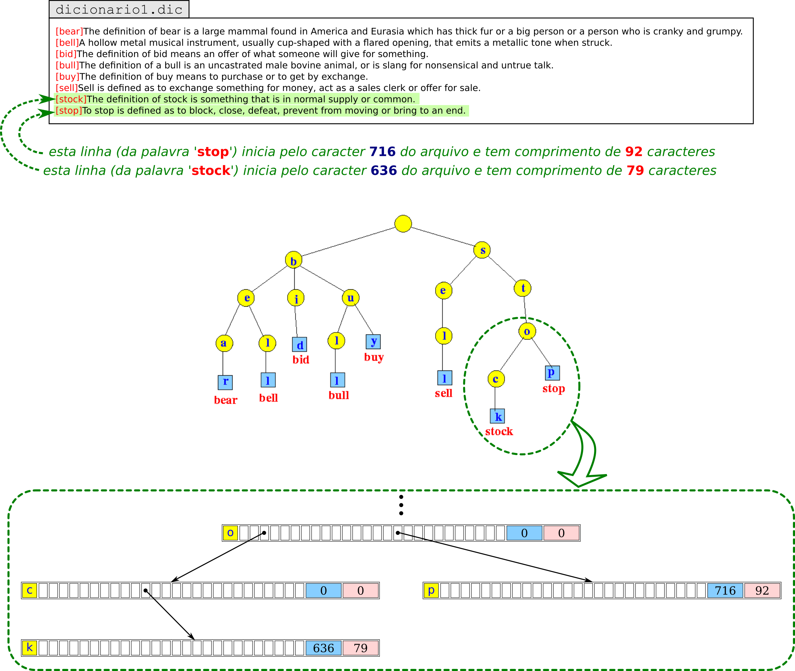

# Trabalho de Implementação II - Identificação de prefixos e Indexação de dicionários

## Objetivo 

Este trabalho consiste na construção e utilização de estrutura hierárquica denominada **trie** (do inglês "re**tri**eval", 
sendo também conhecida como **árvore de prefixos** ou ainda **árvore digital**) para a indexação e recuperação eficiente de palavras em grandes arquivos de dicionários (mantidos em memória secundária). A implementação deverá resolver dois problemas (listados a seguir), e os resultados deverão ser formatados em saída padrão de tela de modo que possam ser automaticamente 
avaliados no VPL.

A figura a seguir exemplifica a organização de um arquivo de dicionário. Cada linha apresenta a definição de uma palavra, sendo composta, no início, pela própria palavra com todos os caracteres em minúsculo (somente entre 'a' (97) e 'z' (122) da tabela [ASCII](https://pt.wikipedia.org/wiki/ASCII)) e envolvida por colchetes, seguida pelo texto de seu significado. Não há símbolos especiais, acentuação, cedilha, etc, no arquivo.



## Primeiro problema: identificação de prefixos

Construir a trie, em memória principal, a partir das palavras (definidas entre colchetes) de um arquivo de dicionário, conforme o exemplo acima. A partir deste ponto, a aplicação deverá receber uma série de palavras quaisquer (pertencentes ou não ao dicionário) e responder se trata de um prefixo (a mensagem '**is prefix**' deve ser produzida) ou não (a mensagem '**is not prefix**' deve ser produzida na saída padrão). Sugestão de nó da trie:

```
NoTrie {
    char           letra;        //opcional
    NoTrie        *filhos[26];   //pode ser uma 'LinkedList' de ponteiros
    unsigned long  posição;
    unsigned long  comprimento;  //se maior que zero, indica último caracter de uma palavra
}
```

## Segundo problema: indexação de arquivo de dicionário

A contrução da trie deve considerar a localização da palavra no arquivo e o tamanho da linha que a define. Para isto, ao criar o nó correspondente ao último caracter da palavra, deve-se atribuir a **posição do caracter inicial** (incluindo o abre-colchetes '['), seguida pelo **comprimento da linha** (não inclui o caracter de mudança de linha) na qual esta palavra foi definida no arquivo de dicionário. Caso a palavra recebida pela aplicação exista no dicionário, estes dois inteiros devem ser produzidos. **Importante**: uma palavra existente no dicionário também pode ser prefixo de outra; neste caso, o caracter final da palavra será encontrado em um nó não-folha da trie e também deve-se produzir os dois inteiros (posição e comprimento) na saída padrão.

